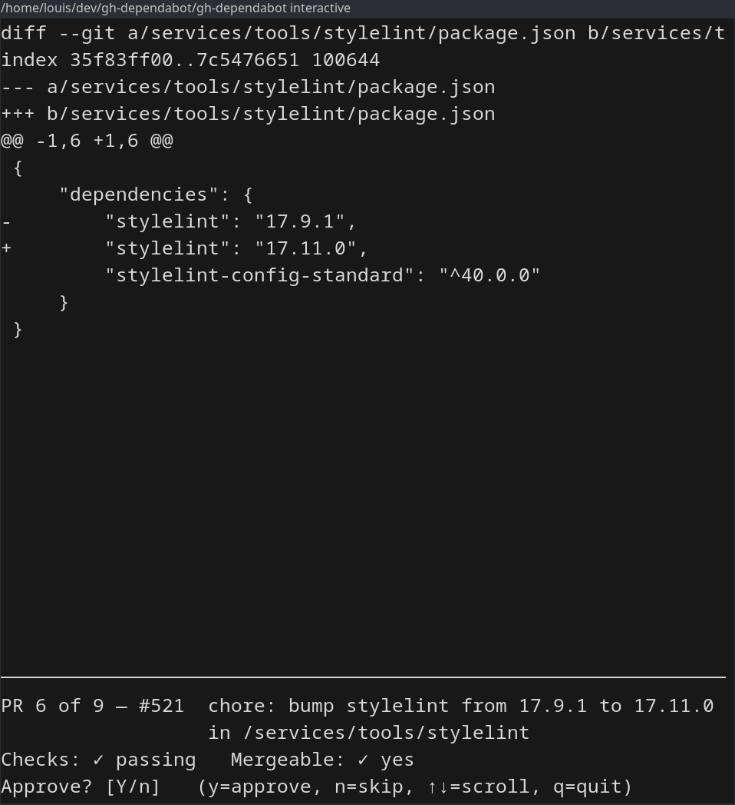

# gh-dependabot

A [GitHub CLI](https://cli.github.com/) extension to interact with pull requests opened by Dependabot on GitHub.

## Requirements

- [GitHub CLI](https://cli.github.com/) (`gh`) version 2.0 or higher
- [Go](https://golang.org/) version 1.26 or higher (only required for building from source)

## Installation

```bash
gh extension install knplabs/gh-dependabot
```

## Usage

Once installed, the extension is available as a `gh` subcommand:

```bash
gh dependabot
```

Use the `--help` flag to see available commands and options:

```bash
gh dependabot --help
```

You can approve Dependabot's PR:

```bash
gh dependabot approve [PR's number...]
```

You can merge Dependabot's PR:

```bash
gh dependabot merge [PR's number...]
```

You can interactively review Dependabot's PRs one by one, with the diff displayed and a `y`/`n` prompt for each:

```bash
gh dependabot interactive
```



Wants more feature? Open an issue, I'll take a look as soon as I can!

## Building from source

1. Clone the repository:

   ```bash
   git clone https://github.com/knplabs/gh-dependabot.git
   cd gh-dependabot
   ```

2. Build the binary:

   ```bash
   go build -o gh-dependabot
   ```

3. Install it locally as a GitHub CLI extension:

   ```bash
   gh extension install .
   ```

## Testing your changes locally

While iterating on the extension, the fastest loop is to build the binary and
run it directly against a real repository — no `gh extension install` step
between rebuilds. The binary shells out to `gh` (which must be authenticated)
and infers the current repository from your working directory.

1. Build the binary from the project root:

   ```bash
   go build -o gh-dependabot .
   ```

2. Move into a repository that has open Dependabot pull requests:

   ```bash
   cd /path/to/some-repo-with-dependabot-prs
   ```

3. Run the binary directly using its absolute path, for example:

   ```bash
   /path/to/gh-dependabot/gh-dependabot interactive
   ```

   Replace `interactive` with `approve`, `merge`, or omit it to launch the
   default list view. Rebuild and re-run after each change.
